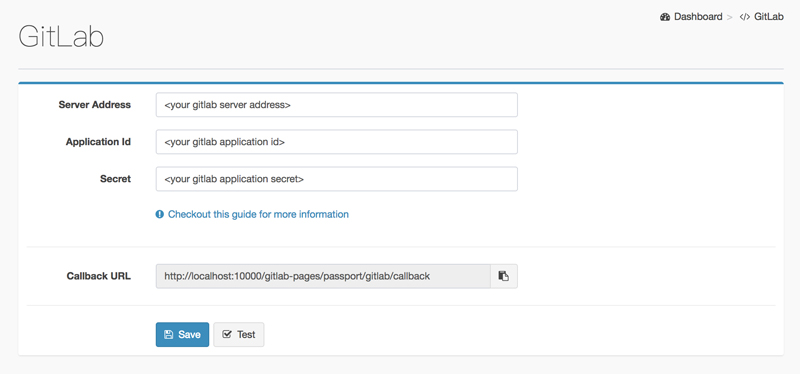

# Gitlab Pages - Extra

An extra GitLab Pages WebServer which supports access control.


## Installation

````bash
git clone https://github.com/xujiaao/gitlab-pages-extra.git # Clone this project.

cd gitlab-pages-extra
npm install # Install dependencies.
npm start   # Start server.
````

> Tips: The default port is 10000, use this command to update it:

````bash
npm start conf # Configure the server.
````

## Configure GitLab Settings

After server started, please login the **Dashboard** to configure GitLab Settings (Default account: `admin/admin123`).



> Tips: Follow [these steps to add an application](https://docs.gitlab.com/ce/integration/oauth_provider.html).


## Upload Pages from Jenkins/GitLabCi

In **Dashboard > Upload** Page, you can get an `upload token` which allows you to upload pages from Command Line.

Here is an example to upload pages through `.gitlab-ci.yml`.

````yaml
cache:
  paths:
    - node_modules/

pages_extra:
  tags:
    - node
  stage: deploy
  script:
    - call npm install bestzip
    - call npm install gitbook-cli
    - gitbook install
    - gitbook build
    - bestzip book.zip _book
    - curl
      -F "token=<your upload token>"
      -F "project=<your project path>"
      -F "pages=@./book.zip"
      http://<your gitlab-pages-extra server address>:10000/gitlab-pages/upload
  artifacts:
    paths:
      - _book
  only:
    - master
````